# 🧠 Variational Quantum Eigensolver (VQE) for Ising Model  
### *A Comparative Analysis of Classical and Quantum Optimization Methods*  
**Authors:** Duc-Truyen Le, Vu-Linh Nguyen, Triet Minh Ha, Cong-Ha Nguyen, Hung Q. Nguyen, Van-Duy Nguyen  
**Date:** March 13, 2025  

---

## 📘 Abstract

This study investigates the **Variational Quantum Eigensolver (VQE)** applied to the **Transverse Ising Model (TIM)** as a benchmark problem.  
A new **hybrid optimization algorithm**, **QN-SPSA+PSR**, is proposed — combining the approximate computation of the **Fubini–Study metric** (from Quantum Natural Gradient) with the **exact gradient evaluation** via the **Parameter-Shift Rule (PSR)**.

This method achieves **faster convergence**, **better numerical stability**, and **low computational cost**, demonstrating promise for **Noisy Intermediate-Scale Quantum (NISQ)** devices.

---

## ⚛️ 1. Introduction

Quantum computers leverage **superposition, probabilistics, and entanglement** to surpass classical computation.  
However, due to current **noise and hardware limitations**, algorithms like **Variational Quantum Algorithms (VQAs)** — notably **VQE** and **QAOA** — are suitable for NISQ devices.

The **VQE** is a hybrid quantum-classical routine used to estimate ground-state energies via the variational principle:

$$
E_g \leq E[\Psi(\theta)] = \frac{\langle \Psi(\theta) | \hat{H} | \Psi(\theta) \rangle}{\langle \Psi(\theta) | \Psi(\theta) \rangle}
$$

where the ansatz $ |\Psi(\theta)\rangle = \hat{U}(\theta)|\Psi_0\rangle $ is optimized to minimize energy.

---

## ⚙️ 2. Variational Quantum Eigensolver Workflow

The VQE process involves four main steps:

1. **Hamiltonian Construction** – Encode the problem into a measurable Hamiltonian $ \hat{H} $.  
2. **Ansatz Preparation** – Build a parametrized quantum circuit $ \hat{U}(\theta) $.  
3. **Measurement Strategy** – Measure expectation values $ \langle \hat{H} \rangle $.  
4. **Optimization Loop** – Update $ \theta $ via classical or quantum optimization.

The hybrid structure ensures:
$$
\text{Quantum: State preparation \& measurement} \quad \leftrightarrow \quad \text{Classical: Optimization}
$$

---

## 🔬 3. Transverse Ising Model (TIM)

Hamiltonian for the 1D TIM ring:
$$
\hat{H}_{TIM} = -J \sum_{n=1}^{N} \sigma_z^{n-1}\sigma_z^{n} - h \sum_{n=0}^{N-1}\sigma_x^{n}
$$

- Exhibits **Z₂ spin-flip symmetry** and **real-valued representation**.  
- Two regimes:
  - $ h < 1 $: Ferromagnetic phase  
  - $ h > 1 $: Paramagnetic phase  
- Critical point at $ h = 1 $.

---

## 🧱 4. Ansatz Construction

### ✦ Symmetry-based design:
- Real coefficients $ C_n \in \mathbb{R} $
- Local spin interaction
- Global spin-flip symmetry $ (\sigma_x)^{\otimes N} $

### ✦ Selected ansatz types:
- **RealAmplitudes** — simple, real-valued rotations $ R_Y(\theta) $, linear entanglement.  
- **EfficientSU2** — complex structure with $ R_X, R_Y, R_Z $ and full entanglement.

Number of variational parameters:
$$
p = N(L + 1), \quad L \geq \frac{2^{N-1} - 1}{N} - 1
$$

---

## 🧮 5. Optimization Methods

| Type | Method | Description |
|------|---------|-------------|
| **Classical** | COBYLA | Derivative-free, stable, low accuracy |
|  | Finite Difference (FD) | Numerical gradient approximation |
|  | SPSA | Stochastic gradient with only 2 evaluations |
| **Quantum** | PSR | Exact gradient using shifted parameters |
|  | QN-BDA | Quantum natural gradient (block-diagonal approx.) |
|  | QN-SPSA | Approximates Fubini–Study metric via SPSA |
| **Hybrid (proposed)** | **QN-SPSA+PSR** | Combines QN-SPSA metric + PSR gradient for stability & efficiency |

Computational cost summary:

$$
\text{Gradient: } \begin{cases}
\text{PSR: } 2p \\
\text{FD: } 2p \\
\text{SPSA: } 2
\end{cases}
\quad
\text{Metric: } \begin{cases}
\text{QN-BDA: } L \\
\text{QN-SPSA: } 4
\end{cases}
$$

---

## 📊 6. Simulation Results

- Tested on **12-spin TIM** using **RealAmplitudes** and **EfficientSU2** ansätze.  
- **QN-SPSA+PSR** achieved:
  - **Faster convergence** than SPSA, FD, and COBYLA.  
  - **Comparable accuracy** to **QN-BDA+PSR** but with **lower cost**.  
- Linear entanglement performed nearly identical to full entanglement.

Estimated ground-state energy vs. field strength $ h $ and qubit number $ N $ matches the exact analytical solution.

---

## 🧾 7. Conclusion

- The **QN-SPSA+PSR** algorithm demonstrates a **quantum advantage** in optimization:  
  - Fast convergence  
  - Stable dynamics  
  - Low computational overhead  
- Well-suited for **NISQ** devices and extensible to **Quantum Machine Learning**.

---

## 🔑 Keywords
`Ising Model`, `VQE`, `Quantum Optimization`, `Ansatz Construction`, `Gradient Estimation`

```mermaid
flowchart TD
  %% ===== KHỞI TẠO =====
  subgraph INIT [Khởi tạo]
    A1[Chọn Hamiltonian H_TIM] --> A2[Chọn ansatz: RealAmplitudes hoặc EfficientSU2]
    A2 --> A3[Khởi tạo tham số θ₀]
    A3 --> A4[Đặt siêu tham số: η₀, s₀, β, số vòng lặp tối đa]
  end

  %% ===== VQE MAIN LOOP =====
  subgraph LOOP [Vòng lặp VQE: k = 0..K]
    direction TB
    B1["Chuẩn bị trạng thái lượng tử |ψ(θₖ)⟩ = U(θₖ)|0⟩"]
    B1 --> QMEAS[Đo lường lượng tử: chia 2 nhánh PSR và QN-SPSA]

    %% --- PSR GRADIENT ---
    subgraph PSR [PSR: Tính gradient chính xác]
      direction TB
      P1[Cho mỗi tham số i]
      P1 --> P2[Đo năng lượng tại θₖ + Δᵢ]
      P2 --> P3[Đo năng lượng tại θₖ - Δᵢ]
      P3 --> P4["Tính gradient gᵢ = s * (f(θ+Δᵢ) - f(θ-Δᵢ))"]
    end

    %% --- QN-SPSA METRIC ---
    subgraph QN [QN-SPSA: Ước lượng metric Fubini–Study]
      direction TB
      S1["Tạo hai vector ngẫu nhiên Δ¹, Δ² ∈ {±1}ᵖ"]
      S1 --> S2[Đo 4 trạng thái để tính 2-SPSA metric]
      S2 --> S3[Tạo estimator H̄ₖ từ 4 phép đo]
      S3 --> S4["Làm mượt: H̃ₖ = (k/(k+1))·H̃ₖ₋₁ + (1/(k+1))·H̄ₖ"]
      S4 --> S5["Tạo metric nghịch đảo ổn định Mₖ = sqrt(H̃ₖ² + βI)"]
    end

    QMEAS --> PSR
    QMEAS --> QN

    %% --- CLASSICAL UPDATE ---
    subgraph CLASSICAL [Cập nhật tham số cổ điển]
      direction TB
      C1[Tính gradient gₖ từ PSR]
      C1 --> C2["Tính Mₖ⁺ (pseudo-inverse metric từ QN-SPSA)"]
      C2 --> C3[Cập nhật θₖ₊₁ = θₖ - ηₖ·Mₖ⁺·gₖ]
      C3 --> C4["Kiểm tra điều kiện dừng: |θₖ₊₁ - θₖ| < ε hoặc max_iter"]
    end

    PSR --> CLASSICAL
    QN --> CLASSICAL

    CLASSICAL -->|Nếu chưa hội tụ| B1
    CLASSICAL -->|Nếu hội tụ| END[Trả về θ*, năng lượng E*]
  end
```

